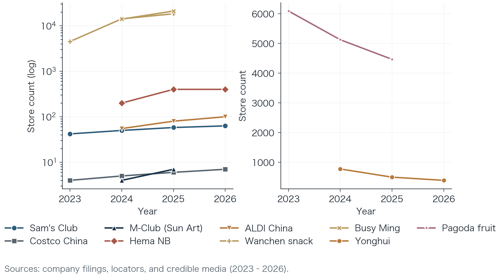

<div align="center">

# China Food Retail Format Restructuring

**Dual Discounting · Product Capability · Urban Density**

Junyi Hu (Duke University) &amp; Ziheng Jin (University of Science and Technology of China)

Independent Industry Research Report · 2026  
<sub>30 June 2026 &nbsp;·&nbsp; Data cut-off 14 June 2026</sub>

<br>

<a href="https://jackiehujunyi.github.io/Report-of-China-Food-Retail-Format-Restructuring/">
  
</a>
&nbsp;
<a href="https://jackiehujunyi.github.io/Report-of-China-Food-Retail-Format-Restructuring/report.html">
  
</a>
&nbsp;
<a href="pdf/China-Food-Retail-Format-Restructuring-2026.pdf">
  
</a>

<br><br>



</div>

<br>

---

<br>

### Cite

```bibtex
@techreport{hu2026foodretail,
  title  = {China Food Retail Format Restructuring:
            Dual Discounting, Product Capability, and Urban Density},
  author = {Hu, Junyi and Jin, Ziheng},
  year   = {2026},
  month  = jun,
  note   = {Independent industry research report.
            Data cut-off: 14 June 2026},
  url    = {https://jackiehujunyi.github.io/Report-of-China-Food-Retail-Format-Restructuring/}
}
```

<br>

---

<br>

<div align="center">

<sub>
For industry research only — not investment, legal, or securities advice.<br>
Affiliations are for identification; no institutional endorsement implied.<br>
© 2026 Junyi Hu & Ziheng Jin
</sub>

</div>
